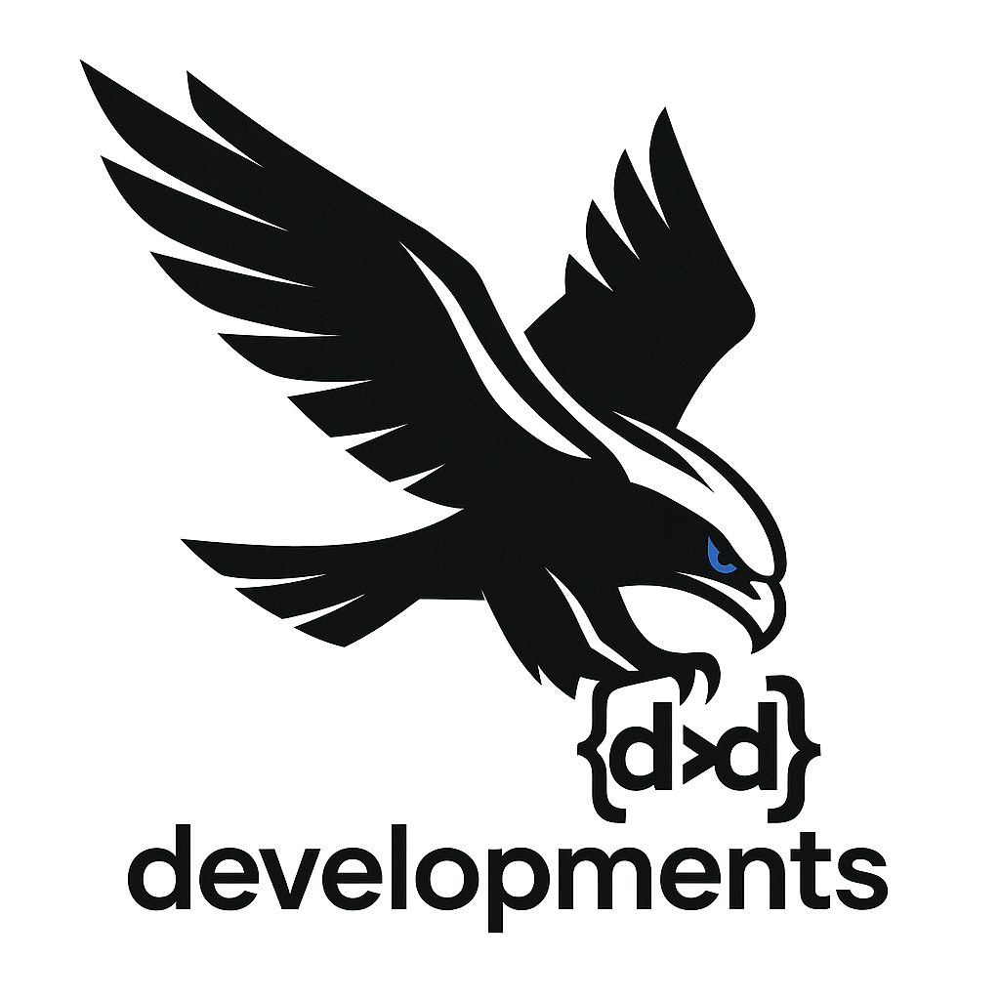

<p align="center">
  <a href="https://dd-developments.com" target="_blank" rel="noopener">
    
  </a>
</p>

<h1 align="center">🧩 Laravel Dynamic Relations</h1>

<p align="center">
  <strong>Dynamic, declarative & trait-driven Eloquent relations for modern Laravel apps</strong><br>
  by <a href="https://dd-development.com">dd-developments</a> — Hosted in Belgium 🇧🇪
</p>

<p align="center">
  <a href="https://packagist.org/packages/dd-developments/laravel-dynamic-relations">
    
  </a>
  <a href='[](https://github.com/dd-developments/laravel-dynamic-relations/actions/workflows/test.yml) '>
    
  </a>
  
  
  
  
</p>

---

## 💡 What is Laravel Dynamic Relations?

**Laravel Dynamic Relations** brings a *next-level modularity* to your Eloquent models.  
Instead of hardcoding relationships like `hasMany()` or `belongsTo()`, you can **define, register and resolve them dynamically** — via traits or config — keeping your models lightweight and flexible.

Think of it as *“Eloquent relationships, but hot-swappable.”*  
Every model can declare its links without being tightly coupled to others.

---

## ✨ Key Features

✅ **Trait-first design** – Attach reusable relationship traits to any model  
⚙️ **Declarative configuration** – Centralize mappings via `config/dynamic-relations.php`  
🧬 **Runtime registration** – Define relations on-the-fly with `DynamicRelations::for()`  
🧩 **All relation types supported** – `hasOne`, `hasMany`, `belongsTo`, `belongsToMany`, and all morphs  
🚀 **Zero boilerplate** – Auto-registered via the Service Provider  
🧱 **Modular & package-friendly** – Ideal for microservice or multi-module Laravel setups  
💥 **“Everything is hot-swappable” philosophy** – Replace, extend, or override any relation dynamically

---

## ⚙️ Installation

```bash
composer require dd-developments/laravel-dynamic-relations
php artisan vendor:publish --tag=dynamic-relations-config

That’s it. The service provider automatically hooks into Laravel’s boot cycle and enables runtime mapping.
🧬 Example — Trait-Based Relation

Add reusable relationship logic to any model using traits.

use DdDevelopments\DynamicRelations\Facades\DynamicRelations;

trait HasManyImages
{
    protected static function bootHasManyImages(): void
    {
        DynamicRelations::for(static::class, 'images', fn ($model) =>
            $model->morphMany(Image::class, 'imageable'));
    }
}

Then in your model:

use App\Models\Traits\HasManyImages;

class Post extends Model
{
    use HasManyImages;
}

That’s it — no need to touch your Post model’s body again.
Each relation lives in its own modular trait and can be reused across the ecosystem.
🧠 Why this Package Exists

Laravel’s Eloquent ORM is powerful, but static.
Relationships are normally baked directly into models, making code harder to reuse across modules or packages.

Laravel Dynamic Relations fixes that by providing a declarative API and a runtime registration layer, merging the best of both worlds:
config-driven flexibility and trait-based simplicity.
Feature	This Package	Typical Alternatives
Trait-first design	✅	❌
Config-driven maps	✅	⚠️ Partial
Runtime registration (DynamicRelations::for)	✅	❌
Full morph coverage	✅	⚠️
Laravel 12 + Pest v4 support	✅	⚠️
Hot-swappable relations	✅	❌
🧩 Example Config (Optional)

Prefer central control? You can declare all relations from config/dynamic-relations.php:

return [
    App\Models\Post::class => [
        'author' => fn ($m) => $m->belongsTo(App\Models\User::class, 'user_id'),
        'images' => fn ($m) => $m->morphMany(App\Models\Image::class, 'imageable'),
    ],
];

Every time Laravel boots, these are automatically registered — no manual wiring required.
🧰 Ideal Use Cases

    🧩 Modular CMS architectures

    🧱 Multi-tenant or multi-package Laravel setups

    🧪 Package development (shared traits between domains)

    🔁 Dynamic content models (relations change based on config)

    ⚡ Projects embracing “Everything is hot-swappable” philosophy

🧪 Testing Support

This package ships ready for Pest v4 and Orchestra Testbench.
Simply run:

composer test

and you’re good to go.
📜 License

Released under the MIT License
© 2025 dd-developments.com

— All rights reserved.
🧠 Author

Built with 💡 by Daniel Demesmaecker
for dd-development.com

— Hosted in Belgium 🇧🇪

    Everything is hot-swappable.
    Built for modular CMS architectures where every relation is replaceable, extendable, and reusable.

                                          Crafted with precision by dd-development • Innovation through modularity.
